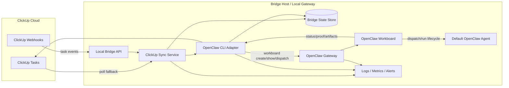

# ClickUp + OpenClaw Architecture

## Overview
ClickUp remains the system of record for clients, projects, and tasks. Bridge runs on the same machine as the local OpenClaw Gateway, turns automation-eligible ClickUp tasks into Workboard cards, dispatches them into the existing OpenClaw runtime, and writes results back to ClickUp for human review.

## Architecture Diagram

## Components

- ClickUp Tasks
  - Source of truth for task state and human-visible history.
- ClickUp Webhooks
  - Push task change events into the local Bridge when available.
- Local Bridge API
  - Private ingress point.
  - Validates auth, deduplicates events, and forwards normalized updates.
- ClickUp Sync Service
  - Reconciles webhook and polling input.
  - Filters tasks using the agreed automation rules.
  - Writes task status and metadata back to ClickUp.
- OpenClaw CLI Adapter
  - Uses the local `openclaw workboard` CLI.
  - Creates cards, dispatches work, and reads card state.
- Bridge State Store
  - Persists task-to-card mapping, idempotency keys, sync timestamps, and execution history.
- OpenClaw Gateway
  - Existing local runtime already running on the host.
- OpenClaw Workboard
  - Queue, status, proof, and execution visibility layer.
  - Real-time operator UI for workload tracking.
- Default OpenClaw Agent
  - Processes Bridge-dispatched Workboard cards.
- Logs / Metrics / Alerts
  - Captures sync failures, dispatch failures, blocked work, and restart recovery.

## Task Flow

1. A task is created or updated in ClickUp.
2. Webhook or poll input reaches the local Bridge.
3. The sync service normalizes the task and stores an idempotency record.
4. The sync service ignores non-automation tasks and forwards eligible ones to the OpenClaw adapter.
5. The adapter creates or updates a matching Workboard card.
6. The adapter triggers Workboard dispatch.
7. The default OpenClaw agent picks up the card and starts execution.
8. OpenClaw Workboard tracks running, review, done, blocked, and synced-back states plus proof and completion metadata.
9. Bridge reads the terminal Workboard result and writes the summary back to ClickUp.
10. The ClickUp task is moved to `human-review` on successful completion, or to the agreed blocked path on failure.

## Failure Handling

- Webhook outage
  - polling keeps the system synchronized.
- Duplicate event
  - idempotency key prevents duplicate card creation.
- Bridge restart
  - state store and Workboard mapping allow reconciliation.
- Gateway restart
  - Bridge re-reads Workboard state before retrying dispatch or write-back.
- Blocked run
  - useful output is preserved and summarized back to ClickUp.

## Recommended MVP Shape

- One private Bridge service.
- One Bridge state store.
- One OpenClaw CLI adapter.
- One existing local OpenClaw Gateway.
- One Workboard queue.
- One default OpenClaw agent path for execution.
- Polling as the fallback path even if webhooks are enabled.
