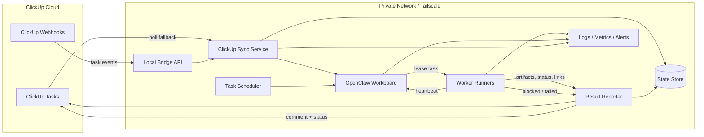

# ClickUp + OpenClaw Architecture

## Overview
ClickUp remains the system of record for clients, projects, and tasks. OpenClaw runs as a private worker system behind a local bridge, claims tasks from ClickUp, executes them in a controlled workboard, and writes outcomes back to the originating task.

## Architecture Diagram

## Components

- ClickUp Tasks
  - Source of truth for clients, projects, task state, and human-visible history.
- ClickUp Webhooks
  - Pushes task change events into the private bridge when available.
- Local Bridge API
  - Private ingress point inside Tailscale.
  - Validates auth, deduplicates events, and forwards normalized updates.
- ClickUp Sync Service
  - Reconciles webhook and polling input.
  - Converts ClickUp tasks into OpenClaw jobs.
  - Writes task status and metadata back to ClickUp.
- OpenClaw Workboard
  - Queue and lease manager for active jobs.
  - Prevents duplicate processing and tracks ownership.
- Task Scheduler
  - Selects the next eligible job using status, priority, labels, and lease availability.
- Worker Runners
  - Execute bounded jobs.
  - Emit heartbeats, logs, and progress events.
- Result Reporter
  - Posts final summaries, links, and error notes to the source ClickUp task.
- State Store
  - Persists job state, idempotency keys, retries, and execution history.
- Logs / Metrics / Alerts
  - Captures timeouts, crashes, retries, and stalled leases.

## Task Flow

1. A task is created or updated in ClickUp.
2. Webhook or poll input reaches the local bridge.
3. The sync service normalizes the task and stores an idempotency record.
4. The scheduler places the task on the workboard if it is eligible.
5. A worker leases the task and starts execution.
6. The worker sends periodic heartbeats.
7. The worker produces artifacts such as PRs, commits, logs, or docs.
8. The result reporter writes the summary and outcome back to the ClickUp task.
9. The task is marked `done`, `review`, `blocked`, or `failed`.

## Failure Handling

- Webhook outage
  - polling keeps the system synchronized.
- Worker crash
  - lease expires and the task becomes reclaimable.
- Duplicate event
  - idempotency key prevents double-processing.
- Timeout
  - scheduler marks the job stale and records the reason in ClickUp.
- Partial success
  - useful output is preserved, unresolved work is marked blocked.

## Recommended MVP Shape

- One private bridge service.
- One sync service.
- One workboard queue.
- One worker process per active job.
- One reporter that always writes back to ClickUp.
- Polling as the fallback path even if webhooks are enabled.

